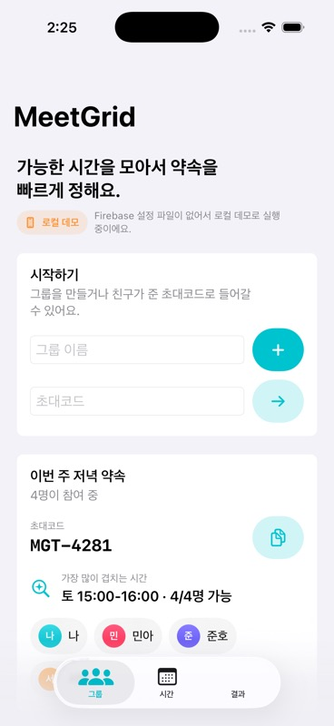
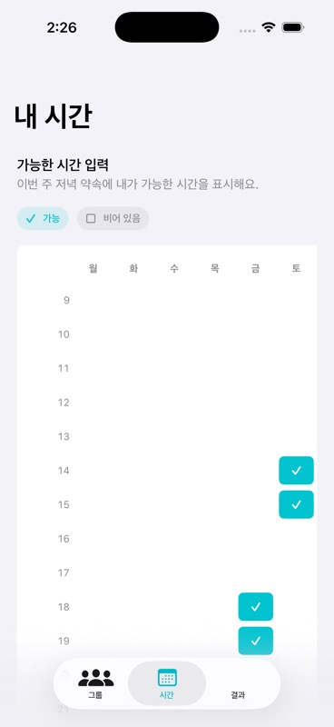
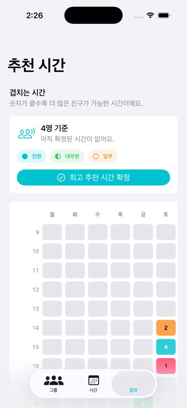

# MeetGrid

친구끼리 약속 시간을 정할 때 각자 가능한 시간을 입력하고, 가장 많이 겹치는 시간대를 자동으로 찾아주는 iOS 앱입니다.

> 기말 미니프로젝트: iOS + SwiftUI + Firebase 기반 약속 시간 조율 앱

## 프로젝트 개요

### 개발 배경

친구들과 약속을 잡을 때 단체 채팅방에서 "언제 돼?", "나는 금요일 저녁 가능", "토요일은 몇 시?" 같은 메시지가 반복됩니다. 사람이 직접 가능한 시간을 모아 비교하면 시간이 오래 걸리고, 중간에 누락되기 쉽습니다.

MeetGrid는 이 과정을 앱 안의 주간 시간표로 단순화합니다. 그룹을 만들고 초대코드를 공유하면, 각자가 가능한 시간을 체크하고 앱이 겹치는 시간대를 숫자와 색상으로 보여줍니다.

### 해결하고자 한 문제

- 단체 채팅에서 가능한 시간을 수동으로 모아야 하는 번거로움
- 여러 사람의 가능 시간을 한눈에 비교하기 어려운 문제
- 약속 후보 시간이 많아질수록 의사결정이 느려지는 문제

### 핵심 목표

- 초대코드 기반 친구 그룹 생성 및 참가
- 주간 시간표에서 가능한 요일/시간 선택
- 모든 멤버의 가능 시간 겹침 계산
- 가장 적합한 약속 시간 추천 및 확정
- Firebase를 이용한 사용자 인증과 데이터 저장

## 주요 기능

| 기능 | 설명 |
| --- | --- |
| 그룹 생성 | 약속 그룹을 만들고 초대코드를 자동 발급합니다. |
| 초대코드 참가 | 친구가 공유한 초대코드로 같은 그룹에 참여합니다. |
| 가능 시간 입력 | 월요일부터 일요일까지 시간대별로 가능한 시간을 선택합니다. |
| 겹침 결과 확인 | 각 시간대에 가능한 인원 수를 히트맵 형태로 확인합니다. |
| 추천 시간 확정 | 가장 많이 겹치는 시간을 추천하고 약속 시간으로 확정합니다. |
| Firebase 연동 | 익명 로그인, 그룹 데이터, 시간 선택 정보를 Firestore에 저장합니다. |

## 앱 화면

### 1. 그룹 생성 및 초대코드



그룹 이름을 입력해 약속 그룹을 만들고, 발급된 초대코드를 친구에게 공유할 수 있습니다.

### 2. 가능한 시간 선택



사용자는 주간 시간표에서 가능한 시간을 체크합니다. 선택된 칸은 색상과 체크 아이콘으로 표시됩니다.

### 3. 겹치는 시간 추천



각 시간대별 가능한 인원 수를 숫자와 색상으로 보여주고, 가장 많이 겹치는 시간을 확정할 수 있습니다.

## 사용 흐름

1. 앱 실행 후 Firebase 익명 로그인이 자동으로 진행됩니다.
2. 사용자가 약속 그룹을 생성합니다.
3. 앱이 초대코드를 발급합니다.
4. 친구는 초대코드로 그룹에 참가합니다.
5. 각자 가능한 시간대를 선택합니다.
6. 결과 탭에서 겹치는 시간을 확인합니다.
7. 가장 적합한 시간을 약속 시간으로 확정합니다.

## 기술 스택

| 구분 | 사용 기술 |
| --- | --- |
| Platform | iOS |
| Language | Swift |
| UI | SwiftUI |
| State | Observation, `@Observable`, `@Environment` |
| Backend | Firebase |
| Auth | Firebase Authentication Anonymous Login |
| Database | Cloud Firestore |
| Package | Swift Package Manager |
| IDE | Xcode |

## 프로젝트 구조

```text
MeetGrid/
├── MeetGridApp.swift
├── AppView.swift
├── Models/
│   ├── SchedulingModels.swift
│   └── SampleData.swift
├── State/
│   └── AppState.swift
├── Firebase/
│   ├── FirebaseBootstrap.swift
│   └── FirebaseGroupRepository.swift
└── Views/
    ├── GroupsView.swift
    ├── AvailabilityView.swift
    ├── ResultsView.swift
    └── Components.swift

Firebase/
└── firestore.rules

docs/
├── screenshots/
└── video/
```

## 구현 포인트

### 1. 가능한 시간 모델링

요일과 시작 시간을 `TimeSlot`으로 표현하고, 사용자별 선택 시간을 `Set<TimeSlot>`으로 저장했습니다. 중복 선택을 막고 빠르게 포함 여부를 계산하기 위해 `Set`을 사용했습니다.

### 2. 겹침 시간 계산

모든 요일/시간 슬롯을 순회하면서 각 멤버가 해당 슬롯을 선택했는지 검사합니다. 이를 통해 `4/4명 가능`, `3/4명 가능` 같은 추천 정보를 계산합니다.

### 3. Firebase 연동

앱 시작 시 `GoogleService-Info.plist`가 있으면 Firebase를 초기화합니다. 이후 익명 로그인으로 사용자 UID를 만들고, 그룹과 가능 시간 데이터를 Firestore에 저장합니다.

### 4. 로컬 데모 모드

Firebase 설정 파일이 없을 때도 앱을 실행해 볼 수 있도록 샘플 데이터를 포함했습니다. 공개 저장소에는 개인 Firebase 설정 파일을 포함하지 않습니다.

## Firebase 설정

공개 저장소에는 개인 Firebase 설정 파일을 올리지 않습니다. 직접 실행하려면 다음 단계를 진행합니다.

1. Firebase Console에서 iOS 앱을 생성합니다.
2. Bundle ID를 `jwlee.MeetGrid`로 등록합니다.
3. `GoogleService-Info.plist`를 다운로드합니다.
4. Xcode에서 `MeetGrid/` 폴더에 추가하고 target membership을 체크합니다.
5. Authentication에서 Anonymous 로그인을 활성화합니다.
6. Cloud Firestore를 생성합니다.
7. [Firebase/firestore.rules](Firebase/firestore.rules) 내용을 Firestore Rules에 반영합니다.

## 실행 방법

1. Xcode에서 `MeetGrid.xcodeproj`를 엽니다.
2. Scheme을 `MeetGrid`로 선택합니다.
3. iPhone Simulator 또는 실제 iPhone을 선택합니다.
4. Run 버튼을 눌러 실행합니다.

Firebase 설정 파일이 없으면 로컬 샘플 데이터로 실행됩니다.

## 발표 영상

YouTube 영상 링크: 업로드 후 여기에 추가

영상은 3분 이내로 아래 흐름에 맞춰 구성할 예정입니다.

1. 앱을 만든 이유
2. 그룹 생성 및 초대코드
3. 가능한 시간 선택
4. 겹치는 시간 확인 및 확정
5. Firebase 저장 구조 설명

자세한 촬영 흐름은 [docs/video/demo-script.md](docs/video/demo-script.md)에 정리했습니다.

## 자체 평가 기준 대응

| 평가 항목 | MeetGrid에서의 대응 |
| --- | --- |
| 효용성 | 친구 약속 시간 조율이라는 명확한 문제를 해결합니다. |
| 완결성 | 그룹 생성, 참가, 시간 입력, 추천, 확정 흐름을 구현했습니다. |
| 직관성 | 탭 구조와 주간 시간표 UI로 기능 위치를 쉽게 파악할 수 있습니다. |
| 라벨링 | 그룹, 시간, 결과 등 짧고 명확한 용어를 사용했습니다. |
| 시각디자인 | SwiftUI 기반의 카드, 색상 히트맵, 아이콘을 사용했습니다. |
| 학습용이성 | 선택 가능한 칸과 결과 숫자를 직접 보여줍니다. |
| 피드백 | Firebase 연결 상태, 저장 상태, 확정 상태를 텍스트로 제공합니다. |
| 오류 정정 | 빈 초대코드, 없는 그룹, Firebase 오류 상황을 메시지로 안내합니다. |
| 정보성 | README와 발표 영상 흐름을 통해 앱 목적과 사용법을 설명합니다. |

## 개발자

- jwlee1008

